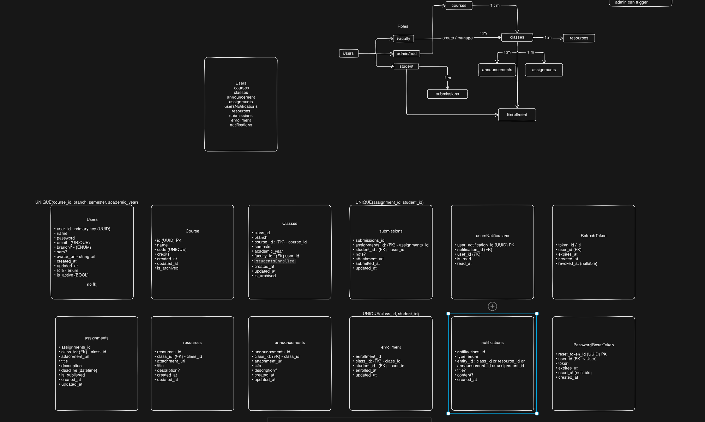
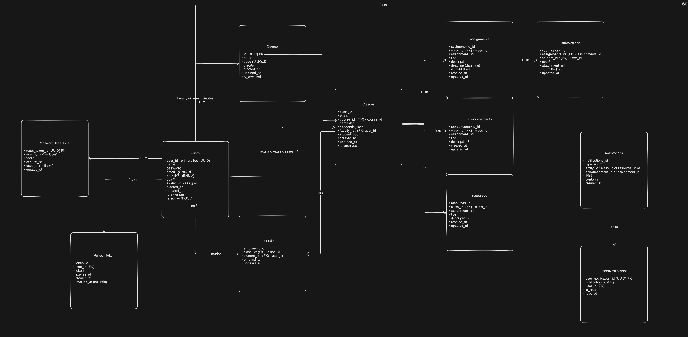

# Learning Management System (LMS)

> ✅ **Backend v1 complete** — All core modules are built and functional. Frontend development is next.

## What is this?

A web-based LMS where faculty can create courses, manage classes, post assignments and resources, and students can enroll, submit work, and track their academics. Built with a clean modular architecture, role-based access control, and production-ready auth patterns.

---

## Current Status

### ✅ Completed

| Module | Description |
|--------|-------------|
| **Authentication** | Login, logout, token refresh (rotation), forgot password, reset password |
| **Users** | Registration, profile fetch, change password, role-based user lookup |
| **Courses** | CRUD, archive/unarchive, lookup by ID or code |
| **Classes** | Ties a course to a faculty for a specific semester/year/branch, archive/unarchive |
| **Enrollments** | Enroll/unenroll students in classes, bidirectional lookups, unique constraint |
| **Assignments** | Faculty posts assignments with deadlines, file attachments (Supabase Storage) |
| **Resources** | Course materials (PDFs, images) shared per class with cloud storage |
| **Submissions** | Students submit work against assignments, ownership + deadline enforcement |
| **Announcements** | Faculty/admin announcements to classes, enrollment-gated for students |
| **Infrastructure** | Docker + Docker Compose setup, Prisma migrations, centralized error handling |
| **Caching** | Redis read-through cache on all GET endpoints, pattern-based invalidation on writes |
| **Logging** | Structured logging with Pino + pino-http, request/response auto-logging |
| **Notifications** | Async notification server consuming RabbitMQ events (FCM/email ready) |
| **Middleware** | JWT auth, RBAC (role-based access), Zod body + params validation, Multer file upload |

### 📋 Planned

| Module | Description |
|--------|-------------|
| **Frontend** | Flutter frontend (not yet started) |

---

## Tech Stack

| Layer | Technology |
|-------|------------|
| Backend | Express 5 · TypeScript 6 · Node.js 20 |
| Database | PostgreSQL 15 · Prisma 7.8 (PrismaPg adapter) |
| Caching | Redis 7 · ioredis |
| Messaging | RabbitMQ 4 · amqplib |
| Logging | Pino · pino-http |
| Auth | JWT (access + refresh tokens) · bcrypt · crypto |
| File Storage | Supabase Storage · Multer |
| Validation | Zod 4 |
| DevOps | Docker · Docker Compose |
| Frontend | TBD |

---

## Project Structure

```
LMS project/
├── docker-compose.yml    # Single orchestrator for all services
├── .env                  # Shared environment variables
├── .env.example          # Template for new developers
├── backend/              # REST API (Express + Prisma)
│   ├── src/
│   │   ├── modules/      # Domain modules (auth, users, courses, ...)
│   │   ├── middlewares/   # Auth, RBAC, validation, error handling
│   │   ├── shared/        # Reusable utilities, errors, constants
│   │   ├── config/        # Environment config, Redis, Swagger
│   │   └── db/            # Prisma client setup
│   ├── prisma/            # Schema + migrations (source of truth)
│   ├── ARCHITECTURE.md    # Design decisions & flow diagrams
│   └── README.md          # Backend-specific docs
├── notification_server/   # Async notification service (RabbitMQ consumer)
│   ├── src/
│   └── prisma/            # Schema copy (read-only, no migrations)
└── frontend/             # (Not yet started)
```

---

## Getting Started

```bash
# Clone the repo
git clone <repo-url>
cd "LMS project"

# Copy env template and fill in your values
cp .env.example .env

# Run with Docker (recommended)
docker compose up --build

# Backend API:       http://localhost:8000
# Notification Svc:  http://localhost:3001
# RabbitMQ UI:       http://localhost:15672 (guest:guest)
# PostgreSQL:        localhost:5432
# Redis:             localhost:6379
```

Or run locally (requires Node.js 20+, PostgreSQL, Redis):

```bash
cd backend
npm install
npx prisma generate
npx prisma migrate deploy
npm run dev
# App: http://localhost:3000
```

---

## System Design



## Database Schema



---

## Architecture Highlights

- **Layered modules** — Each domain follows Route → Controller → Service → Repository
- **Stateless access tokens** + **stateful refresh tokens** with rotation and revocation
- **Password reset** uses SHA-256 hashed tokens (raw token never stored)
- **Password change/reset revokes all sessions** across devices
- **Zod validation** sanitizes both `req.body` and `req.params` before any business logic runs
- **Soft-archive pattern** — Courses (and classes) are archived, never deleted

See [`backend/ARCHITECTURE.md`](./backend/ARCHITECTURE.md) for full design decisions and flow diagrams.

---

## Roles

| Role | Capabilities |
|------|-------------|
| **STUDENT** | View own profile, enroll in classes, submit assignments, change password |
| **FACULTY** | All student capabilities + view any user, manage their classes |
| **ADMIN** | Full access — create courses, manage all users, archive/unarchive |
